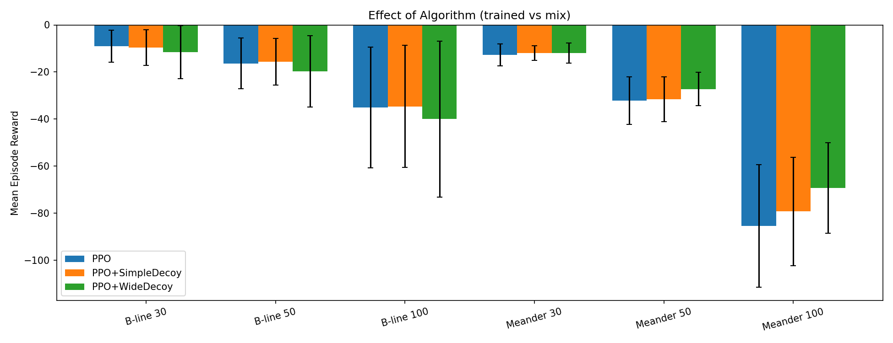

# FlowGuard
### Network-Centric Reinforcement Learning for Autonomous Cyber Defence

---

## Milestones

- [x] **M1** — Familiarize with CybORG / CAGE 2. Train a defensive agent that performs well against the supplied red agents using a standard RL algorithm.
- [ ] **M2** — Extend CAGE 2 with network-centric observations and actions (e.g. monitor traffic, block communication between endpoints).
- [ ] **M3** — Train and compare three agents:
  - One using standard observations and standard actions
  - One using network-centric observations and standard actions
  - One using network-centric observations and network-centric actions
- [ ] **M4** *(if time allows)* — Explore abstractions over the network extensions and compare training efficiency and agent fitness.

---

## Motivation

Modern autonomous cyber defence agents typically operate at the **host level** — scanning individual machines, removing malware, and restoring systems from backup. This approach ignores a rich source of information: **the network itself**.

FlowGuard investigates whether giving a defensive RL agent visibility into network traffic flows, and the ability to act at the network level (e.g. blocking connections between endpoints), leads to meaningfully better defence outcomes.

This project builds on the [CAGE 2 Challenge](https://github.com/cage-challenge/cage-challenge-2) and the [CybORG](https://github.com/cage-challenge/CybORG) simulation environment, using [CybORG++](https://github.com/alan-turing-institute/CybORG_plus_plus) as the base.

> **Note:** Early exploratory work was started in a [separate fork](https://github.com/OmarxBouden/network-aware-cyberdefence) of the original CAGE 2 repo. Development has since moved here, building on CybORG++ for its bug fixes and cleaner codebase. MiniCAGE (also part of CybORG++) was not used, as its abstracted internals complicates extending the environment with new observations and actions.

---

## Research Questions

1. Does adding **network-centric observations** (traffic flows, connection state) improve a defensive agent's performance over standard host-level observations alone?
2. Does adding **network-centric actions** (blocking connections, isolating subnets) on top of network observations lead to further improvement?
3. What are the trade-offs in training efficiency and policy complexity across configurations?

---

## Agent Configurations

Three agents are trained and compared (M3):

| Agent | Observations | Actions |
|-------|-------------|---------|
| **Baseline** | Standard (host-level) | Standard (Analyse, Restore, Remove, Decoy) |
| **NetObs** | Network-centric + standard | Standard |
| **NetFull** | Network-centric + standard | Network-centric + standard |

Agents are trained using standard deep RL algorithms (e.g. PPO, or others as determined during M1) against the two CAGE 2 red agents (B-line and Meander), and evaluated using the official CAGE 2 evaluation protocol.

---

## M1 — Reproducing CAGE 2

**Evaluation protocol.** Mirrors `cage-challenge-2/CybORG/Evaluation/evaluation.py`: 100 episodes against each of `{B-line, Meander, Sleep}` at `{30, 50, 100}` step horizons; reported score is the sum of the 9 means. Constants live in `scripts/config.py`.

**Approach.** SB3 PPO (MlpPolicy, [64, 64]) trained against a mixed B-line / Meander opponent with seed 42 for 1M timesteps. Two decoy prologues are applied at inference on top of the trained model. Maskable PPO is kept as an M2 placeholder for when host-centric actions are added.

**Variants.**

| Variant | Description |
|---|---|
| **PPO** | Plain SB3 PPO baseline. |
| **PPO + Simple Decoy** | 4-action prologue: DecoyApache on Enterprise0/1/2 + Op_Server0, then defer to PPO. |
| **PPO + Wide Decoy** | 17-action prologue across seven high-value hosts; the per-host action indices are taken from the Cardiff CAGE 2 submission, then defer to PPO. |

All three reuse the same trained weights — the heuristics are inference-time only. Simple Decoy adds the smallest reasonable prologue (one decoy on each high-value host); Wide Decoy extends to multiple decoy types and more hosts.

**Training opponent.** PPO is also trained against B-line only and Meander only as a sanity check on the mix choice; results are in the table below.

**What we explored.** Frame-stacked observations, recurrent (LSTM) policies, and a scan-history observation augmentation were also evaluated across multiple overnight training rounds. None improved on the chosen lineup at our 1M-step budget; they are not part of the M1 surface here.

**Reproducibility.** `scripts/utils.py:MixedEnv` uses a seeded `random.Random` for red-agent selection; SB3 trainers and the sweep are also seeded.

### M1 Results

Mean episode reward per (red, episode-length) combination, 100 episodes each. Sleep columns are 0 (omitted). Lower magnitude is better.

| Variant | bline 30 | bline 50 | bline 100 | meander 30 | meander 50 | meander 100 | **Total** |
|---|---:|---:|---:|---:|---:|---:|---:|
| PPO baseline (bline-trained) | -12.0 | -18.4 | -41.0 | -12.7 | -30.5 | -87.3 | -201.9 |
| PPO baseline (meander-trained) | -14.7 | -31.9 | -92.9 | -11.5 | -27.9 | -71.7 | -250.5 |
| **PPO baseline (mix-trained)** | **-9.0** | -16.4 | -35.1 | -12.8 | -32.2 | -85.5 | **-190.9** |
| **PPO + Simple Decoy** | -9.6 | **-15.7** | -34.7 | -12.0 | -31.6 | -79.3 | **-182.9** |
| **PPO + Wide Decoy** | -11.6 | -19.7 | -40.0 | -11.9 | **-27.2** | **-69.3** | **-179.8** |

**Reading the table.** Mix-trained PPO is the best training distribution (5% better than B-line, 24% better than Meander), so it is the headline baseline. The two prologues split the per-red wins: Simple's shorter prologue is better against B-line (focused attacker, decoys quickly), Wide's longer prologue is better against Meander (random attacker, more entry hosts covered). Wide Decoy is the overall winner at **-179.8**.

**On the gap to published top teams.** The Cardiff CAGE 2 winning submission reaches **-54.57** with the same nominal recipe (PPO + greedy decoys). The single largest difference is training budget: Cardiff trained for **10M timesteps (10× ours)**. Other differences in their submission (a reduced ~36-action space, runtime red-agent fingerprinting) are smaller contributors. M1's deliverable here is a reproducible baseline against which M2's network-observation extensions will be measured — not a leaderboard run.

---

## M3 Results

*To be filled in after M3.*

| Agent | vs B-line (30) | vs B-line (50) | vs B-line (100) | vs Meander (30) | vs Meander (50) | vs Meander (100) | Total |
|-------|---------------|---------------|----------------|----------------|----------------|-----------------|-------|
| Baseline | — | — | — | — | — | — | — |
| NetObs | — | — | — | — | — | — | — |
| NetFull | — | — | — | — | — | — | — |
